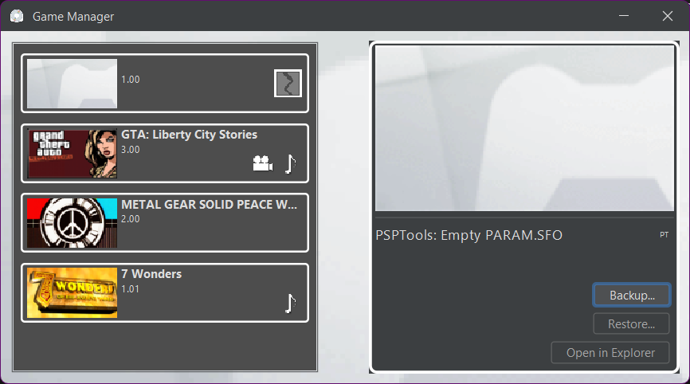
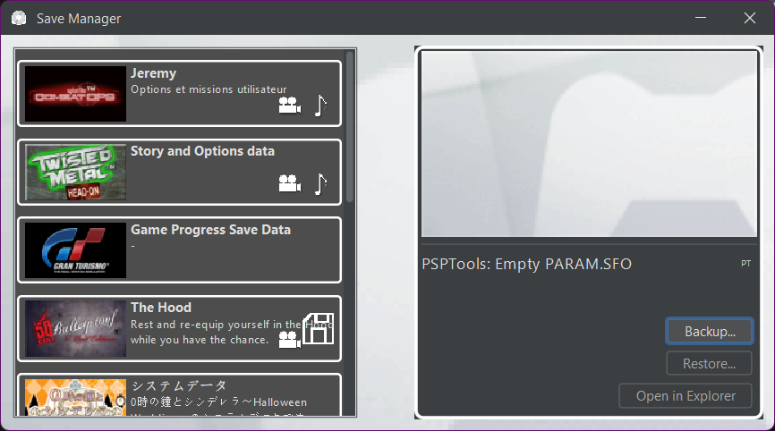
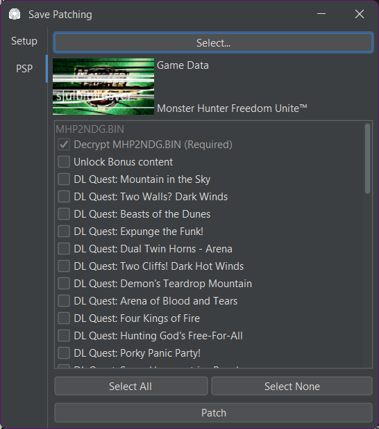
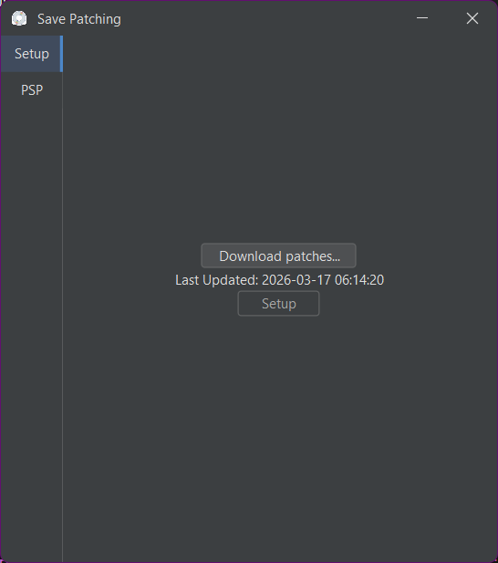
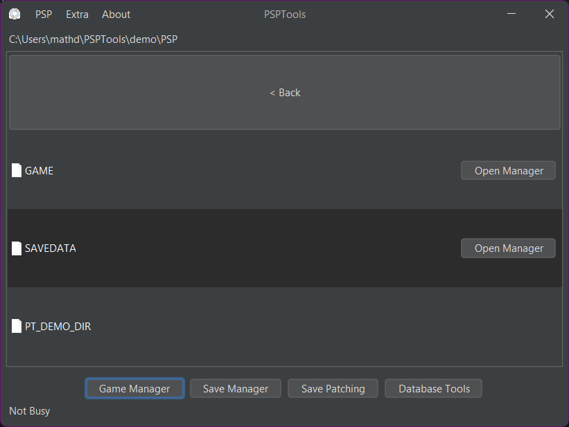

# PSPTools

 [](https://github.com/xFN10x/PSPTools/actions/workflows/gradle.yml)

Various tools for managing your Playstation® Portable, Playstation® Vita, or any other playstation save. (PS3-PS5)

Features include:

### Game Manager
 

### Save Manager
 

### Database Tools
 

### File Manager


### 
> [!TIP]
> **Using JAR**
>
> If you don't have a prebuilt version of PSPTools made for your platform, you can use the cross-platform jar. To do this you need to have java 25 installed. You can get one at <https://learn.microsoft.com/en-ca/java/openjdk/download#openjdk-25>

> [!NOTE]
> **For Flavourtown Users/Shipwrights**
> 
> For testing, please use the demo mode. Or, if you actually own a PSP or Vita, you can try that to get the full experiance.


## Special Thanks

- **[bucanero](https://github.com/bucanero)** - Save patching & save database ([apollo-lib](https://github.com/bucanero/apollo-lib), [apollo-patches](https://github.com/bucanero/apollo-patches), [apollo-saves](https://github.com/bucanero/apollo-saves)) Support them here: <https://www.patreon.com/dparrino>
- **[georgemoralis](https://github.com/georgemoralis)** - [JPCSP](https://github.com/jpcsp/jpcsp)'s UMD ISO reader, used for reading ISO files.

## Building
PSPTools is made with gradle, so building is easy.

 Simply clone this repo, or [download the code](https://github.com/xFN10x/PSPTools/archive/refs/heads/main.zip), then run the following command in a terminal:

 ```terminal
 ./gradlew build jpackage
 ```

This command should output an uber-JAR in the build/builtJars folder, and an executeable build in build/builtDist
